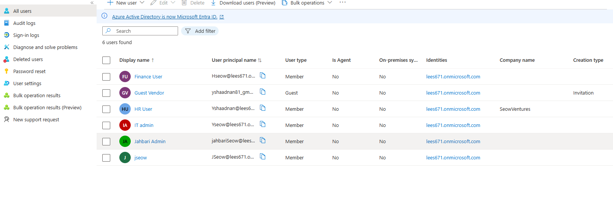
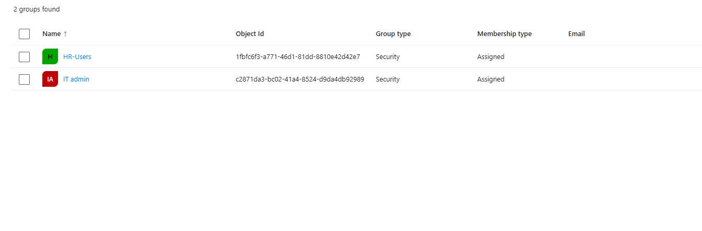

# Microsoft Entra ID – Identity & Access Management Lab

This lab demonstrates hands-on skills in **Microsoft Entra ID**, including **Privileged Identity Management (PIM)**, **Conditional Access**, **Entitlement Management**, and **Access Reviews**.  

The lab simulates enterprise identity and access management to showcase **Zero Trust principles**, **least privilege access**, and **identity governance**.
## Conditional Access

- Implemented **Conditional Access policies** enforcing MFA for all users  
- Scoped policies to balance security and usability, preventing administrative lockouts  
- Applied **Zero Trust principles** to secure cloud applications and sensitive resources  

**Business Problem Solved:**  
- Reduces risk of **unauthorized access** to corporate systems and sensitive data  
- Enforces compliance requirements for multi-factor authentication  
- Protects the organization from phishing, credential theft, and insider threats  
- Ensures only the right users from trusted devices/locations can access critical applications  
---
## Privileged Identity Management (PIM)

- Configured **eligible role assignments** requiring MFA and time-bound activation  
- Roles are activated **just-in-time** to enforce least privilege principles  
- Monitored and audited **role activations** for compliance and security  

**Business Problem Solved:**  
- Reduces risk of **over-privileged accounts** and insider threats  
- Ensures **temporary elevated access** only when needed, minimizing attack surface  
- Provides audit trails for **compliance and regulatory requirements**  
- Aligns with **least privilege and Zero Trust principles**, giving secure access without permanent admin rights  
## Users & Groups

- Created users simulating employees, admins, and external vendors  
- Configured groups such as `HR-Users`, `IT-Admins`, `Finance-Users`, and `All-Employees`  
- Assigned users to groups according to roles for proper access management  

  
*Overview of user accounts created for the lab environment.*

  
*Shows group memberships and assignments for access control.*

---

## Privileged Identity Management (PIM)

- Configured **eligible role assignments** requiring MFA and time-bound activation  
- Roles are activated **just-in-time** to enforce least privilege principles  
- Monitored and audited **role activations** for compliance and security  

  
*High-level view of PIM dashboard showing eligible roles and assignments.*

  
*Example of a role assigned as eligible, requiring activation before use.*

  
*Configuration settings for PIM roles, including MFA and activation duration.*

  
*Demonstration of a role activated just-in-time for temporary access.*

---

## Conditional Access

- Implemented **Conditional Access policies** enforcing MFA for all users  
- Scoped policies to balance security and usability, preventing administrative lockouts  
- Applied **Zero Trust principles** to secure cloud applications and sensitive resources  
  
*Policy overview and assignment scope for targeted users or groups.*
  
*Creating a new Conditional Access policy in Microsoft Entra ID.*

  
*Detailed policy settings includin*
