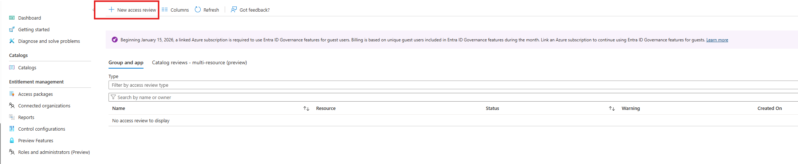

# Microsoft Entra ID – Identity & Access Management Lab

This lab demonstrates hands-on skills in Microsoft Entra ID, including Privileged Identity Management (PIM), Conditional Access, Entitlement Management, and Access Reviews. The lab simulates enterprise identity and access management to show Zero Trust principles, least privilege access, and identity governance.

---

## Users & Groups
- Created users simulating employees, admins, and external vendors
- Configured groups such as HR-Users, IT-Admins, Finance-Users, and All-Employees
- Assigned users to groups according to role

---

## Privileged Identity Management (PIM)
- Configured eligible role assignments with MFA and time-bound activation
- Activated roles just-in-time to align with least-privilege principles
- Monitored and audited role activations

---

## Conditional Access
- Implemented Conditional Access policies enforcing MFA for all users
- Scoped policies to reduce risk while preventing administrative lockout
- Applied Zero Trust principles to secure cloud applications

---

## Entitlement Management (Access Packages)
- Built access packages to automate HR group onboarding and approvals
- Configured time-bound access and approval workflows

---

## Access Reviews
- Created resource access reviews to validate user access
- Ensured least privilege and compliance through periodic reviews

## Technologies
- Microsoft Entra ID, Azure AD, PIM, Conditional Access, Identity Governance, Access Packages, Access Reviews, Azure AD Logs

